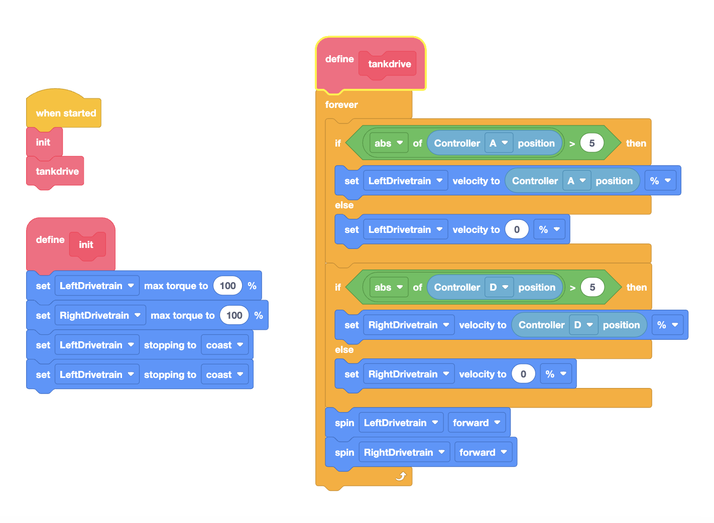
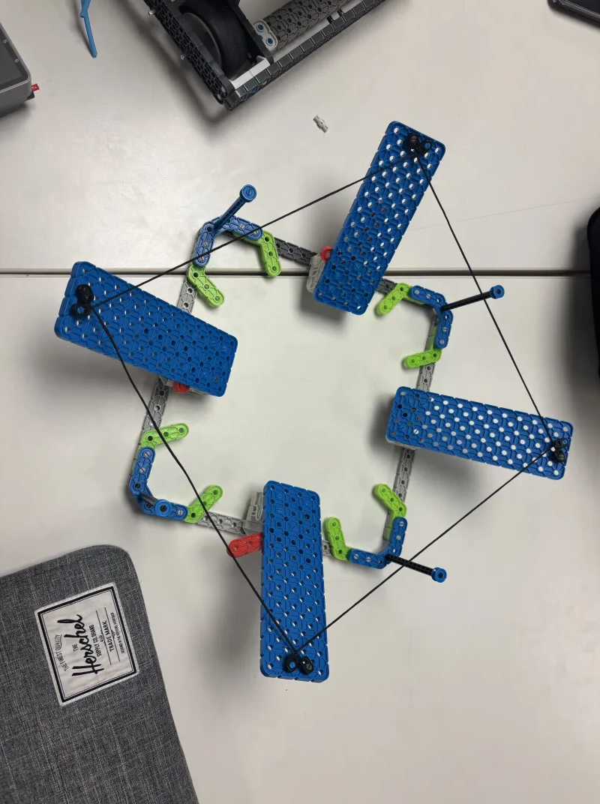
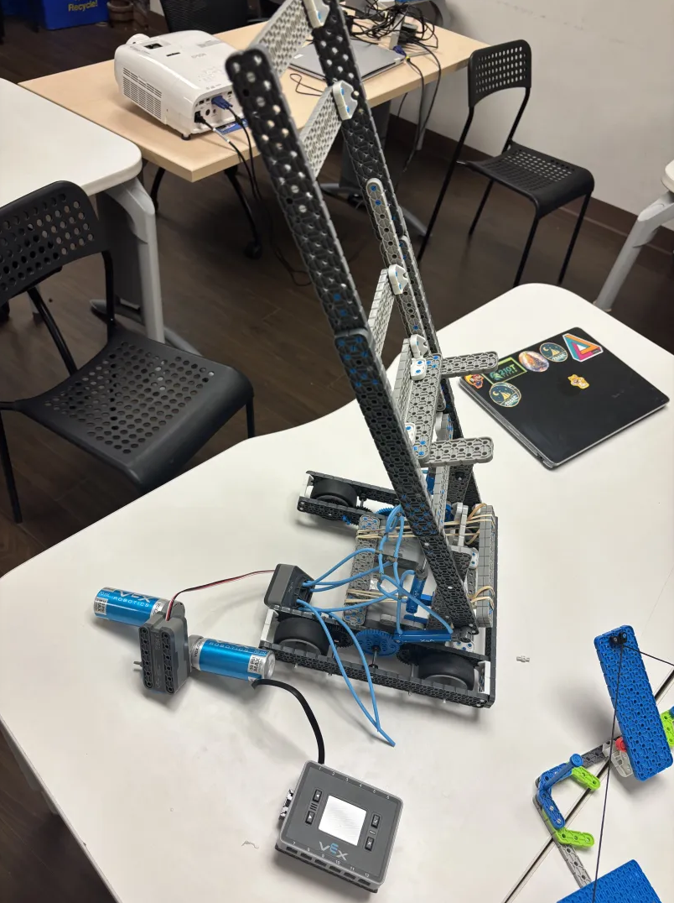
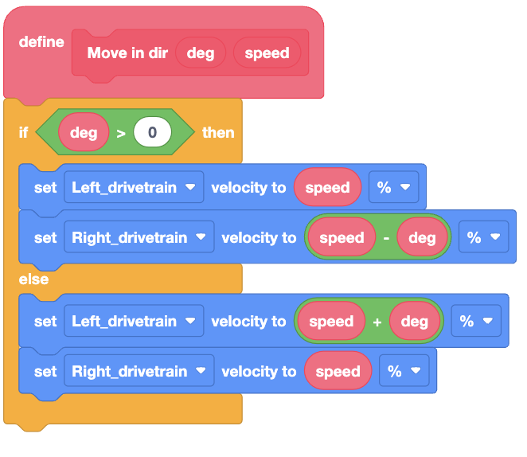
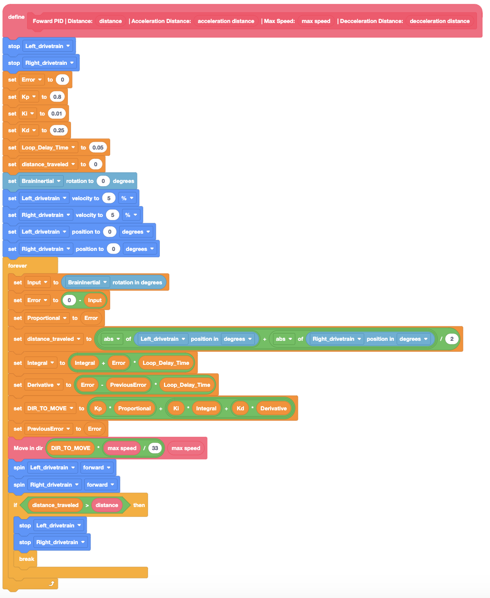

# 220H Rapid Relay Season Information

## Introduction

***

## Martin Liu
**Team Roles:**     

**Age:** 14

**Hobbies:** Robotics, Programming, Python, YouTube, Geometry Dash, BTD6, Hollow Knight, Skul: The Hero Slayer

**Introduction:** Hi! I am Martin and I love programming. I would take hours just coding on PyCharm. And I would argue to DEATH that PyCharm is better than VSCode. VSCode isn't bad, but PyCharm is BETTER >:) Another thing that I would argue about is MACOS OVER WINDOWS. MAN HOW DO YOU EVEN NAVIGATE FILES IN WINDOWS :) YOU DON'T... I personally find Windows computers more confusing than my math teacher yapping away about why calculus is important and what we are learning :( Dislike Windows computers, mac for life 🎉

**Media:**   

**Contact Information:**\
\

***

## Eric Jones
**Team Roles:**   

**Age:** 14

**Hobbies:** Robotics, 3D printing, CAD, Drone flying, SCUBA Diving, Theater, Zelda, Content Creation

**Introduction:** Hello, my name is Eric Jones. I have been interested in robotics for as long as I can remember. I go to West Ridge Middle School in Calgary Alberta. I am on V5RC team 2088E and VIQRC team 220H. I am working on building a full DIY 3D printed tool changer called the M.I.T.E. I can't wait to see how the team does this year and my goal is to get both teams to worlds! I want to be a robotics or mechatronics engineer when I am older!

**Media:** 

**Contact Information:**\

***

## Eric Yao
**Team Roles:**  

**Age:** 14

**Hobbies:** YouTube, skiing, coding, UAVs, maybe math, reading, 3D printing, video games, table tennis, robotics, badminton

**Introduction:** Hello, my name is Eric Yao. I am 14 years old, and I'm in grade 9 attending St. Vincent De Paul Elementary and Junior High School. I'm on the 220H - Low IQ team, and the 2088E - Eellogofusciouhipoppokunurious V5RC team. Since I was little, I had interests in engineering and some chemistry experiments. I enjoy doing things that require lots of creativity, testing ,and improvising like building, baking, drawing and one time designing stuff for a school project. I also have some interests in 3D printing, drones - which I thought was really fascinating since I'm little, and programming - I have done some of those competitive coding problems in the C++ language.

**Media:**
N/A

**Contact Information:**\
N/A

***

# 220H Media 
\
\

# Logbook
Here is a detailed log of which day we worked on the robot and how we improved it.

|       Date        |                                                                                                                                                                                                                                                                                                                                                                                                                                                                                                                                                                                                                                                                                                                                                           Building                                                                                                                                                                                                                                                                                                                                                                                                                                                                                                                                                                                                                                                                                                                                                           |                                                                                                                                                                                                                                                                                                                                                                                                                                                                                                                                                                                                                                                                                                                                                                                                                                                                                                                                                                                                                                                                                                                                                                                                                                                                                                Programming                                                                                                                                                                                                                                                                                                                                                                                                                                                                                                                                                                                                                                                                                                                                                                                                                                                                                                                                                                                                                                                                                                                                                                                                                                                                                                |                                                                      Notes/Others                                                                       |
|:-----------------:|:----------------------------------------------------------------------------------------------------------------------------------------------------------------------------------------------------------------------------------------------------------------------------------------------------------------------------------------------------------------------------------------------------------------------------------------------------------------------------------------------------------------------------------------------------------------------------------------------------------------------------------------------------------------------------------------------------------------------------------------------------------------------------------------------------------------------------------------------------------------------------------------------------------------------------------------------------------------------------------------------------------------------------------------------------------------------------------------------------------------------------------------------------------------------------------------------------------------------------------------------------------------------------------------------------------------------------------------------------------------------------------------------------------------------------------------------------------------------------------------------------------------------------:|:---------------------------------------------------------------------------------------------------------------------------------------------------------------------------------------------------------------------------------------------------------------------------------------------------------------------------------------------------------------------------------------------------------------------------------------------------------------------------------------------------------------------------------------------------------------------------------------------------------------------------------------------------------------------------------------------------------------------------------------------------------------------------------------------------------------------------------------------------------------------------------------------------------------------------------------------------------------------------------------------------------------------------------------------------------------------------------------------------------------------------------------------------------------------------------------------------------------------------------------------------------------------------------------------------------------------------------------------------------------------------------------------------------------------------------------------------------------------------------------------------------------------------------------------------------------------------------------------------------------------------------------------------------------------------------------------------------------------------------------------------------------------------------------------------------------------------------------------------------------------------------------------------------------------------------------------------------------------------------------------------------------------------------------------------------------------------------------------------------------------------------------------------------------------------------------------------------------------------------------------------------------------------------------------------------------------------------------------------------------------------------------------------------------------------------------------------------------------------------------------------------------------------------------------------------------------------------------------------------:|:-------------------------------------------------------------------------------------------------------------------------------------------------------:|
| November 10, 2024 |                                                                                                                     Today we built the basic drivetrain. It is a 4 wheel drive powered by 2 motors. The gear ratio is 4:3 (48:36) for speed. After building the drivetrain, the Eric started working on the catapult, at the end (12 PM), the skeleton of the catapult was mostly finished. Martin, in the mean while was working on the catching mechanism, where it catches the balls passed by alliances. He plans for a way to expand/shrink it using pneumatics, but he is only done the skeleton as well. He also experimented with pneumatics in the mean while. [Here](https://youtube.com/shorts/G3R-JmqAIaA?feature=share) is a video of him goofing around with the newly unpacked pneumatics.   This is an image of our catapult when it is fully down.  This is an image of our catapult when it is slightly higher.  This is an image of our funnel is contracted.  This is an image of our funnel when it is expanded.                                                                                                                     |                                                                                                                                                                                                                                                                                                                                                                                                                                                                                                         For programming today we coded the drivetrain. We are using tank drive. The code has a init function to initialise the motors and possibly other parts in the future. After initialising is done, it runs a recursion function (which basically acts like a forever loop) that has the code for tank drive in it. Using recursion functions, there is a lot more agility since you can skip back and forth between functions, etc. A key to the tank drive code is we check if the absolute value of the controller joystick is greater then 5 before taking action. The Vex IQ controller has inaccurate calibrations/sensors and it often returns a small value when it is in the origin position. Meaning that the robot will slowly drive even when the controller is left idle. This is not a code issue but a controller issue. In order to take care of that, we make sure that the controller position is greater than a small value like 5 to make sure that doesn't happen. At around 10:35 AM, we finally got everyone onto the Github. Since Martin forgot to bring his adapter, he had to run off of Eric's computer. After downloading and running a few times, the same error occurred. It turned out there was an issue with recursion and there was most likely a max recursion limit, like python. Removing the recursion limit fixed the issues. He also reversed some motors to make the drivetrain run properly. Now it works perfectly fine.  This is an image of our code for tank drive.                                                                                                                                                                                                                                                                                                                                                                                                                                                                                                          |         This is the first day of IQ and we planned to stay from 9 AM to 12 PM (3hrs). We ended up finishing the drivetrain at around 10:15 AM.          |
| November 11, 2024 | Today is our second day working on the robot! Today is also remembrance day. Martin came before Eric, so he took some pictures and edited yesterday's logbook. Eric will continue to work on the catapult while Martin continues to struggle with the funnel. Today we plan for our session from 9:00 AM to 1:30 PM. The mechanism with the motors for catapult are still in development. We had to blur "220H" out because we changed our team number to 220Z. The intake still needs some work though. Eric Jones then experimented with pneumatics, but failed to make it work the way he preferred. After some innovating, we managed to get a PISTON POWERED catapult working! Using some strategies from VexV5, one solenoid can power 4 pistons. Our intake can inconsistently score both of the balls at once. Consistency still needs to be improved. Martin was working on the funnel, the funnel is big and it can catch at a wide range.  This is an image of new funnel that has been redesigned. It is now 4 sides instead of 8, so save pieces and weight.  This is an image of our catapult, this catapult is more than 20" high, which violates rules. We will be redesigning this soon. |                                                                                                                                                                                                                                                                                                                                                                                                                                                                                                                                                                                                                                                                                                                                                                                                                                                                                                                                                                                                                                                      Martin being the main programmer looked at some autonomous ideas, this years game is quite different from other years since the placements are random. He eventually found this [video](https://www.youtube.com/watch?v=M9IYBMD6cpQ) by team 7163B. Their plan was time saving and efficient. Martin will check if this is breaks any rules, if it doesn't, then this will most likely be the plan that we stick to. No coding was actually done since Martin was mostly working on the funnel.                                                                                                                                                                                                                                                                                                                                                                                                                                                                                                                                                                                                                                                                                                                                                                                                                                                                                                                                                                                                                                                      |            We think the robot might be out of size. I also reminded Eric J to send me and intro for the logbook, which he completely forgot.            |
| November 12, 2024 |                                                                                                                                                                                                                                                                                                                                                                                                                 This is our third day, first, Martin took/added images for yesterday's logbook. Eric J started working on redesigning the catapult, since our robot is WAY over 15" tall. Martin started assembling the flywheels for intake, he is using 40t sprockets with an alternation of thick and thin wires. In order to keep the distance between the sprockets even under the tension of the rubber bands, he filled the center with black half spacers. Here is a [video](https://www.youtube.com/shorts/52RTmOxSgUI). After Martin finished rubber banding the second drivetrain, he moved on to coding a PID for the drivetrain. Eric J on the other hand continued to work with the catapult.                                                                                                                                                                                                                                                                                                                                                                                                                  | Martin started basic PID for autonomous. First, there is no "go towards direction" block, so he made his own function for that. This is what it looks like, even though it doesn't cover every case, it is enough for a forwards PID.  The reason we need it is because we need it for the main driving code. This function also takes in a speed, which we can adjust accordingly inside the ACTUAL PID function. The PID works like this: First is uses the PID algorithm to find the error of the direction of the robot. In this case, direction is measured in degree using brain inertial. Then, it calculates which direction the robot is supposed to move in. This is where the "Move in dir" blocks comes in, we can pass the value into the "move in dir" block so it can adjust our robot. This is actually a strategy that we used in First Lego League and we plan to use this for our Vex V5 team as well. Here is a picture of the full PID function:  As you can see, the function also takes in arguments like "acceleration distance" and "deceleration distance", but it is currently not programed. For our FLL robot, acceleration and deceleration was crucial since it drifts when coming to a sudden stop. But for vex, because of the weight and motors, the robot doesn't run fast enough for the robot to drift, so we are not sure if we still need that feature. Also, you can notice the fact that it turns "DIR_TO_MOVE * (max_speed/33)", this is because of how the way our "Move in dir" function is set up. The "Move in dir" function slows one of the motors according to which way they turn. Surely there's nothing wrong with that right? But assume we set our max speed to 10. This means that the fastest one of the motors are going to go is 10 and the other motor will go at even LOWER speeds. So we limit how much we slow down the other motor to make sure it is positive. Even though it being negative doesn't effect too much, it only means that one of the sides go backwards. We actually do not want that because the speed of it going backwards is not going to be proportional, which means that the turning will be very sharp and uncontrolled. The PID's job is to control the turning, but if we turn it too much it like that, it will be too sensitive. Here is a [demonstration](https://youtube.com/shorts/FajJRx5XFnc?feature=share) of the PID. |                                        We had around 3 hrs of worktime and we got lots done! Especially the PID.                                        |
| November 23, 2024 |                                                                                                                                                                                                                                                      A new Eric has joined out team, previous references of Eric will refer to Eric Jones. The new Eric's last name is Yao, so in the future, they will be referred to as Eric Y and Eric J. After Eric J and Eric Y experimented with the catapult more, they decided to rebuild the catapult from scratch, since there wasn't enough release speed. Martin on the other hand cleaned up some media stuff and decided for film some shots on the catapult with Eric Y, but he decided to yeet the catapult, and he broke it. He later rebuilt it pretty quickly to make up for his mistakes. Here are both videos: [Funnel Film](https://youtube.com/shorts/Bfy1oX-u6tI?feature=share) + [Broken Film](https://youtube.com/shorts/6OXw0sC0OIQ?feature=share). For the catapult, we made a quick release system with pneumatics. Eric Y built a funnel at the front of our robot for self-alignment with the goal. [Here](https://youtube.com/shorts/-PNFLWxecog) is a funny video Martin made while they were working.                                                                                                                                                                                                                                                      |                                                                                                                                                                                                                                                                                                                                                                                                                                                                                                                                                                                                                                                                                                                                                                                                                                                                                                                                                                                                                                                                                                                                                                                                                                                               No programming today since Eric J and Eric Y were mostly working on building.                                                                                                                                                                                                                                                                                                                                                                                                                                                                                                                                                                                                                                                                                                                                                                                                                                                                                                                                                                                                                                                                                                                                                                                                                                                               |                                               Just for logging purposes, we stayed from 10:30AM - 4:00PM.                                               |
| November 24, 2024 |                                                                                                                                                                                                                                                                                                                                                                                                                                                                                                                                                                                                                                                                                                                      Eric J is refining the catapult and Eric Y and Martin is working on the flywheel.                                                                                                                                                                                                                                                                                                                                                                                                                                                                                                                                                                                                                                                                                                                       |                                                                                                                                                                                                                                                                                                                                                                                                                                                                                                                                                                                                                                                                                                                                                                                                                                                                                                                                                                                                                                                                                                                                                                                                                                                                                                    N/A                                                                                                                                                                                                                                                                                                                                                                                                                                                                                                                                                                                                                                                                                                                                                                                                                                                                                                                                                                                                                                                                                                                                                                                                                                                                                                    | Martin is a little mad, Eric J and Eric Y keep saying building is more important than programming. https://youtube.com/shorts/falaeLPgC24?feature=share | 